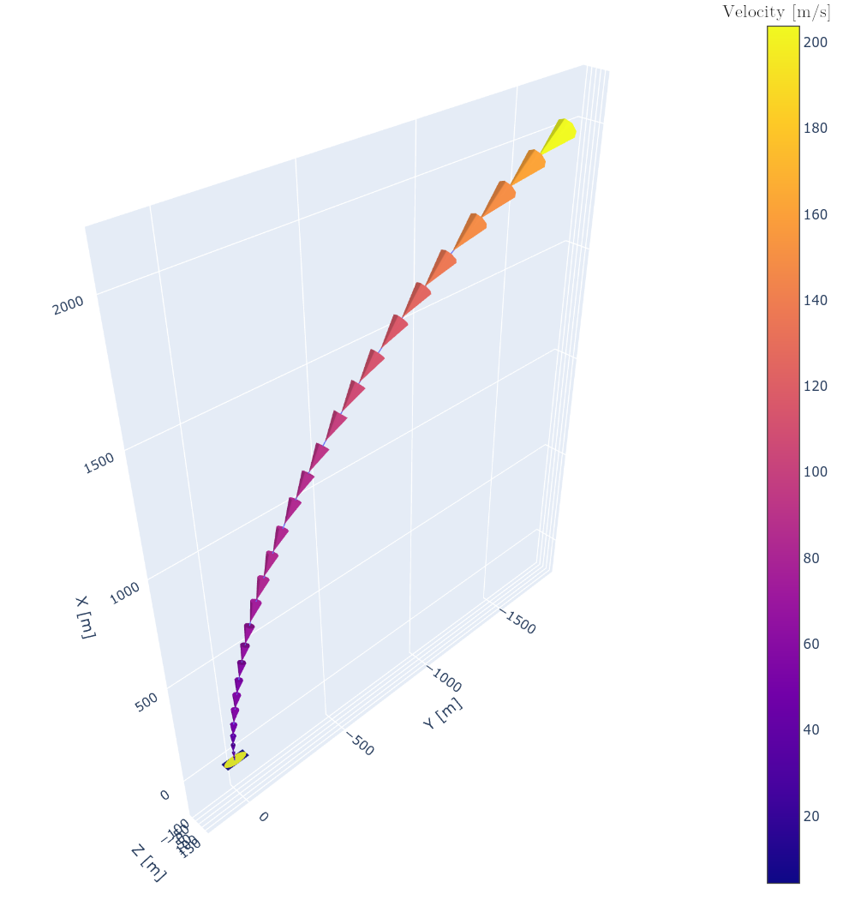
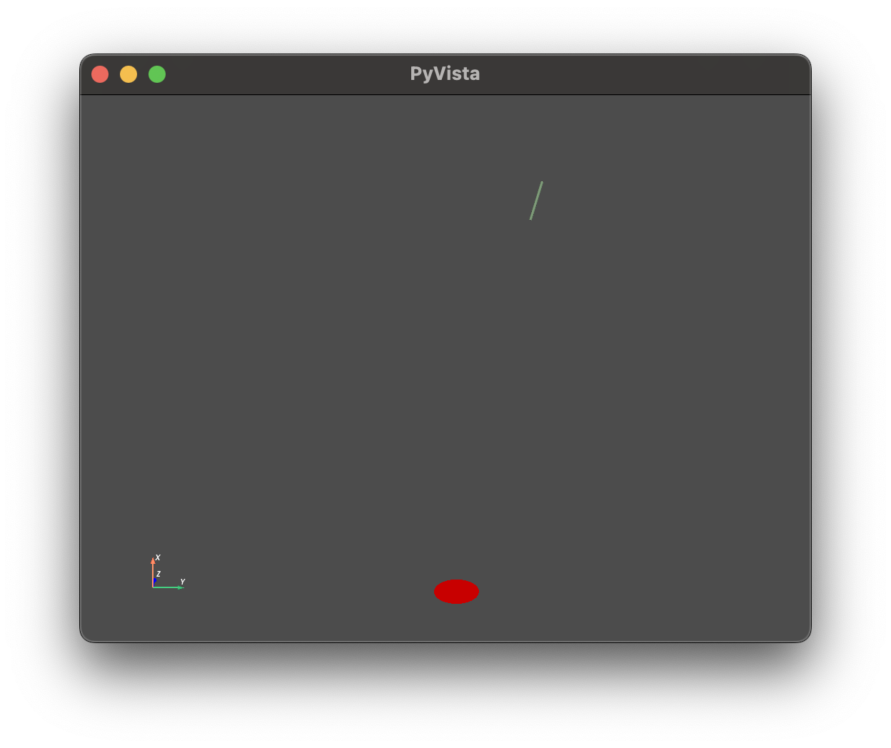

# Rocket SIM 6DOF

This is a Python Gym environment to simulate a 6 degrees of freedom (6DOF) rocket.



## Features

* Full 6DOF rocket landing environment
* Realistic dynamics equations modeled on a rigid body assumption
* Interactive 3D visualization through PyVista
* Available actuators:
    - Thruster
    - Fins
* Wandb logging wrapper

### Continuous Action Space
The environment employs a continuous action space, with the engine allowed to throttle between `maxThrust` and `minThrust`. The thrust is normalized to lie in the range `[-1, +1]` as best practice for algorithm convergence suggests. The engine is gimbaled by two angles, $\delta_y$ and $\delta_z$, around two hinge points, respectively moving the engine around the z and y axes.

## Installation Instructions

1. Clone the repository:
    ```bash
    git clone https://github.com/yourusername/rocket-env.git
    cd rocket-env
    ```

2. Create and activate a virtual environment:
    ```bash
    python3 -m venv venv
    source venv/bin/activate
    ```

3. Install the required dependencies:
    ```bash
    pip install -r requirements.txt
    ```

## Minimal Example with Rendering
Script to test the functionality of the 6DOF environment:

```python
from rocket_env.envs import Rocket6DOF

# Initialize the environment
env = Rocket6DOF(render_mode="human")  # or "rgb_array"
obs, info = env.reset(seed=123)

while True:
    obs, rew, terminated, truncated, info, = env.step(env.action_space.sample())
    env.render()
    
    if terminated or truncated:
        env.reset()
        env.render()

env.close()
```

This will show the rendering:
.

### Minimal Example with Neural Control

```python
import gymnasium as gym
from stable_baselines3 import PPO
from src.rocket_env.envs import Rocket6DOF

# Create the environment
# You can set render_mode="human" or "rgb_array" (if supported by your env)
env = Rocket6DOF(render_mode="human")

# Instantiate the agent
model = PPO("MlpPolicy", env, verbose=1)

# Train the agent
model.learn(total_timesteps=10000)

# Evaluate the agent
obs, info = env.reset(seed=123)
terminated = False
truncated = False

# Example evaluation loop
while not (terminated or truncated):
    action, _states = model.predict(obs, deterministic=True)
    
    # With Gymnasium, step returns (obs, reward, terminated, truncated, info)
    obs, reward, terminated, truncated, info = env.step(action)
    
    # Render if you want to see it
    env.render()
    
    if terminated or truncated:
        obs, info = env.reset()
```